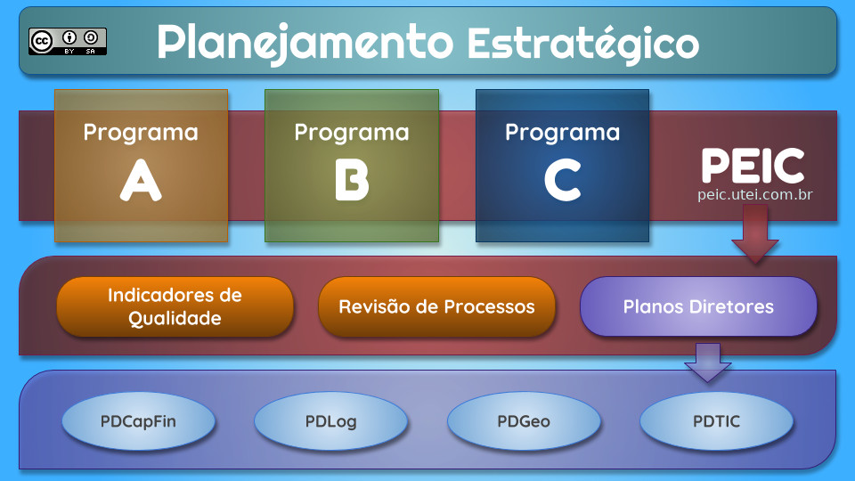

# Considerações Iniciais

## Definição

O **Planejamento Estratégico de Inovação Corporativa \(PEIC\)** é um _framework_ criado para facilitar o processo de inovação de médias e grandes empresas que pode ser aplicado a qualquer tipo de negócio.

## Histórico

Em janeiro de 2019, o [Engenheiro Helton Nogueira Uchoa](http://helton.uchoa.com) apresentou publicamente este conceito com intuito de colaborar nos processos de inovação em nível corporativo. Este produto é resultado da longa experiência em projetos envolvendo inovação com foco em tecnologia e das experiências mais recentes de imersão nos ecossistemas das startups.

Neste vídeo, entenda um pouco de como surgiu a inspiração inicial para criação do **PEIC** e tenha uma compreensão rápida de todo o conjunto.

[https://youtu.be/IW0TrkyyzqY](https://youtu.be/IW0TrkyyzqY)

## Licenciamento

Antes de utilizar o conteúdo do PEIC, entenda as suas obrigações e direitos através do licenciamento.

Este trabalho está licenciado com uma [Licença Creative Commons - Atribuição-CompartilhaIgual 4.0 Internacional](http://creativecommons.org/licenses/by-sa/4.0/).

### Você tem o direito de:

1. **Compartilhar**: copiar e redistribuir o material em qualquer suporte ou formato.
2. **Adaptar**: remixar, transformar, e criar a partir do material para qualquer fim, mesmo que comercial.


O licenciante **não pode revogar** estes direitos desde que você respeite os termos da licença.



Esta licença é aceitável para **Trabalhos Culturais Livres**.


### De acordo com os termos seguintes:

#### Atribuição

Você deve dar o **crédito apropriado**, prover um link para a licença e indicar **se mudanças foram feitas**. Você deve fazê-lo em qualquer circunstância razoável, mas de nenhuma maneira que sugira que o licenciante apoia você ou o seu uso. 


**Crédito apropriado:** Caso seja fornecido, você deve indicar o nome do criador e partes da atribuição, um aviso de direito autoral, um aviso de licença e um link para o material. Licenças CC anteriores à versão 4.0 também requerem a você prover o título do material se fornecido e quaisquer outras mudanças. [Mais informações](https://wiki.creativecommons.org/License_Versions#Detailed_attribution_comparison_chart).



**Se mudanças foram feitas**: Na 4.0, você deve indicar se modificou o material e manter a indicação de modificações anteriores. Na 3.0 e nas versões anteriores das licenças, a indicação de alterações apenas é exigida caso você tenha criado um trabalho derivado. [Guia de Sinalização](https://wiki.creativecommons.org/Best_practices_for_attribution#This_is_a_good_attribution_for_material_you_modified_slightly). [Mais informações](https://wiki.creativecommons.org/License_Versions#Modifications_and_adaptations_must_be_marked_as_such).


#### Compartilha Igual

Se você remixar, transformar, ou criar a partir do material, tem de distribuir as suas contribuições sob a **mesma licença** que o original.


**Mesma licença**: Você também pode utilizar uma das licenças compatíveis listadas em [https://creativecommons.org/compatiblelicenses](https://creativecommons.org/compatiblelicenses). [Mais informações](https://wiki.creativecommons.org/FAQ#If_I_derive_or_adapt_material_offered_under_a_Creative_Commons_license.2C_which_CC_license.28s.29_can_I_use.3F).


**Sem restrições adicionais**

Você não pode aplicar termos jurídicos ou **medidas de caráter tecnológico** que restrinjam legalmente outros de fazerem algo que a licença permita.


**Medidas de caráter tecnológico**: A licença proíbe a aplicação de medidas eficazes de caráter tecnológico, definidas com referência ao Artigo 11 do Tratado da OMPI sobre Direito de Autor. [Mais informações](https://wiki.creativecommons.org/License_Versions#Application_of_effective_technological_measures_by_users_of_CC-licensed_works_prohibited).


### Avisos

Você não tem de cumprir com os termos da licença relativamente a elementos do material que estejam no domínio público ou cuja utilização seja permitida por uma **exceção ou limitação** que seja aplicável.


**Exceção ou limitação:** Os direitos dos usuários sob exceções e limitações, tais como utilização justa \("_fair use_"\) e tratamento justo \("_fair dealing_"\), não são afetados pelas licenças CC. [Mais informações](https://wiki.creativecommons.org/Frequently_Asked_Questions#Do_Creative_Commons_licenses_affect_exceptions_and_limitations_to_copyright.2C_such_as_fair_dealing_and_fair_use.3F).


Não são dadas quaisquer garantias. A licença pode não lhe dar todas as autorizações necessárias para o uso pretendido. Por exemplo, outros direitos, tais como **direitos de imagem, de privacidade ou direitos morais**, podem limitar o uso do material.


**Direitos de imagem, de privacidade ou direitos morais**: Você pode necessitar de autorizações adicionais antes de utilizar o material como pretende. [Mais informações](https://wiki.creativecommons.org/Considerations_for_licensors_and_licensees).


